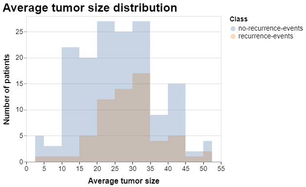

# DSCI_522_Group_1

Group Members: 
Haoyu(Clara) Su, Fanli Zhou, Ke Xin(Margaret) Zhao

Proposal
================

## Data Set

Our Breast Cancer Data Set is obtained from [UCI Machine Learning Repository](https://archive.ics.uci.edu/ml/datasets/Breast+Cancer) [1]. The data set looks at the recurrence and non-recurrence of breast cancer based on 9 features, including groups of age, menopause time, tumor size, ranges of the number of axillary lymph nodes, presence of node in cap, degree of malignancy, breast type, breast quadrant, and whether the patient used radiation therapy. The data set contains 286 instances with missing values. 

## Research Questions

**Main predictive research question:**

What are the top three strongest predictors of breast cancer recurrence? 

**Natural sub-questions:**

1) What is the rate of breast cancer recurrence in the data set? (Descriptive)

2) Which machine learning model can make the best prediction given unseen test data set? (Predictive)

3) Is there any relationship between age and breast cancer recurrence? (Exploratory)

4) Is there any relationship between tumor-size and breast cancer recurrence? (Exploratory)

## Analysis Plan of Action 

We will use the following steps to produce a systematic data analysis:

1) Split the dataset into training (80%) and testing (20%) sets.

2) Check the data for errors/missing/outlier values.

3) Exploratory data analysis on the training set (make tables and figures to explore the features)

4) Preprocess the data including scale numerical features and encode categorical features. 

5) Select different classifiers include decision tree, logistic regression, KNN, SVC, and random forest. 

6) Hyperparameter optimization using cross-validation.

7) Find the best model using the test set, and summarize the weights. 

## Discussion of EDA Table & Figure

We explored the rate of breast cancer recurrence and included the results in the following table. Only around 28.6% of the patients had breast cancer recurrence events, while 71.4% of them don't have any recurrence events. So the train data set is not well balanced, we should keep this in mind during model selection.

To understand the relation between breast cancer recurrence events and age, we made a plot to show the age distribution of patients with or without breast cancer recurrence. Based on the plots, most of the patients in the train data set are between the ages of 30 and 69. Patients at ages 30-39 are more likely to have breast cancer recurrence than other age groups.

To study the relation between breast cancer recurrence events and the average tumor size, we visualized the average tumor size distribution of patients with or without breast cancer recurrence. From the plot, we see that the mean of the average tumor size of patients with breast cancer recurrence is bigger than those without breast cancer recurrence. 

## Share the Results

We will report the weights for each predictor and the top three strongest predictors in a final report document. We decided to share the results with a table and a bar graph. In the table, we will include a column of the predictor names, sorted by weights, and a column of the corresponding weight of the predictor in the model. We will also visualize this table with a bar graph, with the predictor names on the y-axis and weight values on the x-axis. Based on the table and the plot, we can pick out the top three strongest predictors.

### Reference

[1] This breast cancer domain was obtained from the University Medical Centre, Institute of Oncology, Ljubljana, Yugoslavia.  Thanks go to M. Zwitter and M. Soklic for providing the data.